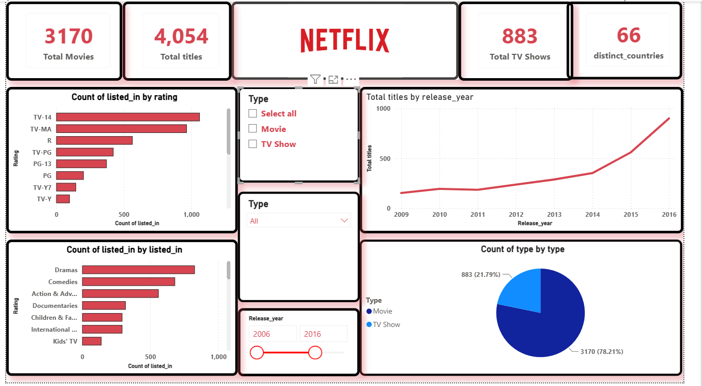

# Netflix_dashboard

# 🎬 Netflix Content Analysis | Power BI Dashboard

An end-to-end Power BI analytics project built on the Netflix titles dataset, analyzing content distribution, genre trends, rating breakdowns, and release patterns across **4,054 titles** spanning **66 countries**.

---

## 📸 Dashboard Preview



---

## 📊 Key KPIs

| 🎬 Total Titles | 4,054 |
| 🎥 Total Movies | 3,170 (78.21%) |
| 📺 Total TV Shows | 883 (21.79%) |
| 🌍 Distinct Countries | 66 |

---

## 📌 Features & Visuals

- **KPI Cards** — Surfaced top-level metrics (Total Movies, Total TV Shows, Total Titles, Distinct Countries) for at-a-glance executive summary.
- **Bar Chart: Content by Rating** — Visualized content distribution across ratings (TV-14, TV-MA, R, PG-13, PG, TV-Y7, TV-Y), revealing TV-14 as the most dominant rating category on the platform.
- **Bar Chart: Content by Genre** — Ranked top genres including Dramas, Comedies, Action & Adventure, Documentaries, and Children & Family titles by volume.
- **Line Chart: Titles by Release Year** — Tracked Netflix's content growth trajectory from 2009 to 2016, highlighting a sharp content expansion post-2013.
- **Pie Chart: Movie vs TV Show Split** — Visualized the content type ratio, confirming Movies significantly outweigh TV Shows at 78.21% vs 21.79%.
- **Slicers** — Enabled dynamic filtering by Content Type (Movie / TV Show) and Release Year range (2006–2016) for interactive exploration.

---

## 💡 Key Insights

- 📈 Netflix's content library grew **exponentially post-2013**, suggesting a strategic pivot toward original and licensed content acquisition.
- 🎭 **Dramas and Comedies** dominate genre offerings, accounting for the largest share of listed titles.
- 🔞 **TV-14 and TV-MA** are the most prevalent ratings, indicating Netflix's primary audience target is adults and young adults.
- 🎥 Movies represent nearly **4 out of every 5 titles**, reflecting Netflix's movie-heavy catalog during the 2006–2016 period.
- 🌍 Content spans **66 distinct countries**, highlighting the global diversity of Netflix's library.

---

## 🛠️ Tools & Techniques

| **Power BI Desktop** | Report design, data modeling, and DAX measure authoring |
| **Power Query (M)** | Data cleaning, type transformations, and null handling on raw CSV |
| **DAX** | Custom measures for Total Movies, TV Shows, Titles, and Distinct Countries |
| **Data Modeling** | Structured relationships to support cross-filter behavior across visuals |
| **GitHub** | Version control for `.pbit` template file for reproducibility |

---

## 🗂️ Dataset

- **Source:** [Netflix Movies and TV Shows — Kaggle](https://www.kaggle.com/datasets/shivamb/netflix-shows)
- **Format:** CSV
- **Records:** 8,807 rows (full dataset); dashboard reflects filtered 2006–2016 range
- **Key Columns:** `title`, `type`, `listed_in`, `rating`, `release_year`, `country`, `date_added`

---


## 📁 Project Structure

```
netflix-powerbi-dashboard/
│
├── Netflix_power_bi_up.pbit     # Power BI template file
├── Netflix_SS.png               # Dashboard screenshot
└── README.md                    # Project documentation
```


## 🙋‍♂️ Author

**Vishnu**
Data Analyst | Power BI | SQL | Python
📍 Hyderabad, India
🔗 [Naukri](https://www.naukri.com/mnjuser/homepage) | [GitHub](https://github.com/koushikvishnuch-gif/Netflix_dashboard)


